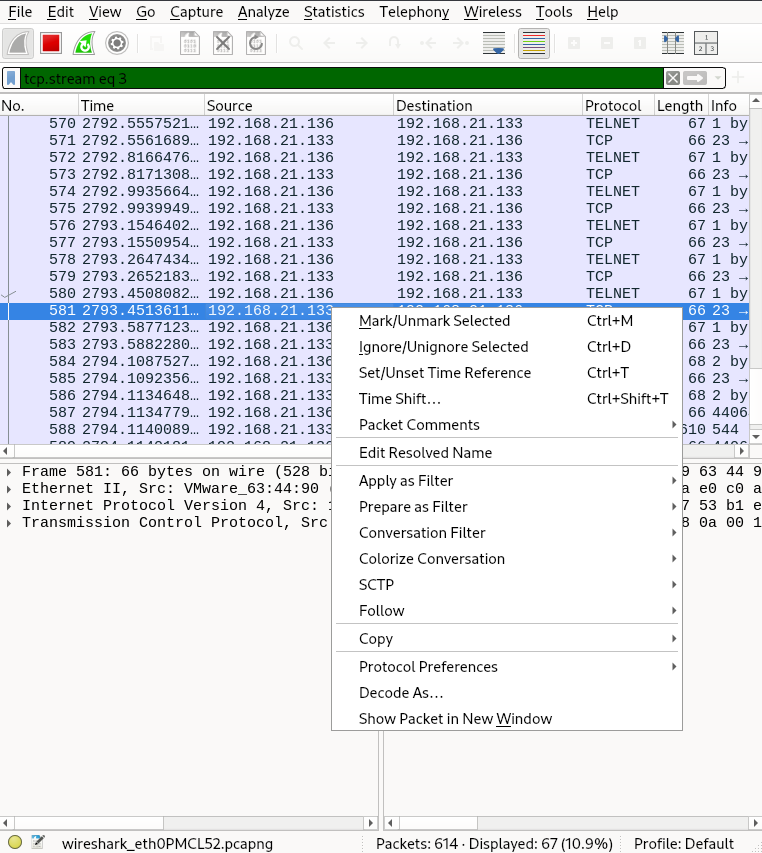

# 🛡️ Lab 1: Cryptographic Attacks: Brute Force and Traffic Analysis on Network Protocols

## 📌 Objective
The purpose of this lab is to simulate brute force attacks against common network services (**FTP**, **TELNET**, **SSH**, and **HTTP**), analyze the security of these protocols, capture and inspect network traffic, and propose security mitigations.

---

## 🖥️ Lab Environment Setup
- **Attacker VM:** Kali Linux 2024.4
- **Target VM:** Vulnerable Linux VM (Metasploitable2 / custom)
- **Tools Used:** Hydra, Burp Suite, Wireshark,

---

## 🧾 Task 1: Enumerate the Target

## 🎯 Goal
Identify valid usernames on the target VM.

## 1.1 Nmap scan
Performed an initial scan to discover open services.
```bash
nmap -p 21,23,22,80 <target-ip> 
```

   

---

## 1.2 Enum4linux Enumeration
Since ports (21,23,22,80) are open, used enum4linux to gather more usernames.
```bash
enum4linux -a <target-ip> 
```

   

    

   

---

##  🔐 Task 2: Brute Force Attacks

## ✅ Preparation

Before conducting brute-force attacks, prepare the following:
Use common lists available in Kali Linux, such as `/usr/share/wordlists/rockyou.txt`
Or manually create a small custom list for testing:
- **Go to wordlist directory**
```bash
cd /usr/share/wordlists
```

- **Username list** 
```bash
touch userlist.txt
vim userlist.txt  
```
   - **Insert in userlist.txt**
```bash
admin
msfadmin
anonymous
user
test
```

- **Password list** 
```bash
touch passlist.txt
vim passlist.txt
```
   - **Insert in passlist.txt**
```bash
1234
msfadmin
ftp123
admin
password 
```

---

## 🔹 2.1 FTP Brute Force with Hydra
Command to attack FTP:
```bash
hydra -L userlist.txt -P passlist.txt ftp://<TARGET_IP> -V
```

   

## 🔹 2.2 Telnet Brute Force with Hydra
Command to attack Telnet:
```bash
hydra -L userlist.txt -P passlist.txt telnet://<TARGET_IP> -V
```

   

## 🔹 2.3 SSH Brute Force with NetExec
Command to attack SSH:
```bash
nxc ssh <TARGET_IP> -u userlist.txt -p passlist.txt
```

   

## 🔹 2.4 HTTP Login Brute Force Using Burp Suite Intruder

### Step 1: Install FoxyProxy Extension
- **Open `Firefox Browser`.**
- **Go to `extension` and search `FoxyProxy`.**
- **Choose the `FoxyProxy Standard` extension and click `Add to Firefox`.**
- **Go to `FoxyProxy extension > Options > Proxies`.**
- **Set the `Title = foxyproxy, Hostname = 127.0.0.1, Port = 8080` and click `Save`.**
- **Go to `FoxyProxy extension` and click `foxyproxy`.**

   

   

   

   

   

### Step 2: Launch Burp’s Browser
- **Open `Burp Suite`.**
- **Go to `Proxy > Intercept`.**
- **Ensure `Intercept is ON`.**
- **Click `Open Browser` to start Burp’s embedded browser.**

   

### Step 3: Search Ip Address Metasploitable2
- **Open `Firefox Browser`.**
- **Search the <TARGET_IP> and click Enter.**
- **Click the `DVWA section`.**
- **Fill the `Username = admin` and `Password = password`.**
- **Left-side, change `DVWA Security > High-Low > Submit`.**
- **Left-side, choose `Brute Force`.**
- **Fill anything to the `Username` and `Password`.`(Example: Username=aaa and Password=aaa)`**

   

   

   

### Step 4: Forward the Request
- **In Burp’s `Proxy > Intercept`.**
- **Always click `Forward`.**
- **If multiple requests are caught, continue forwarding until the page loads.**
- **Go to `Proxy > HTTP history`.** 
- **Find request`GET /dvwa/vulnerabilities/brute/?username=aaa&password=aaa&Login=Login HTTP\1.1`. Then, right click and choose `Send to Intruder`.**

 

 

### Step 5: Disable Intercept
- **Switch `Intercept is OFF` so that future browser requests are not paused.**

 

### Step 6: Configure the Intruder Attack
- **Go to `Intruder > Attack Type > Cluster Bomb `.**
- **Highlight and mark the username and password fields as payload positions.**
- **On the `Payload position`, Load with the file in the with the Username list `(userlist.txt)` and Password list `(passlist.txt)`.**

 

### Step 7: Start Attack
- **Click `Start Attack`.**
- **Go to `Response > Render`.**
- **Try & error each output.**
- **Valid login output `Welcome to the password protected area admin`.**
- **Invalid login Output `Username and/or password incorrect`.**

 

 

---

## 📡 Task 3: Sniffing Network Traffic
Captured network traffic during login attempts with cracked credentials.
**Tool Used: Wireshark** 

## Step 1: Open Wireshark.
- **Command:**
```bash
sudo wireshark
```
- **Choose `eth0` for sniffing traffic.**
   

## Step 2: Start capture on the network interface connected to the target for the FTP.
- **Command:**
```bash
ftp <target-ip> 
```
- **Enter the `Username = msfadmin` and `Password = msfadmin`.**
   

## Step 3: Filter FTP packet.
- **Command:**
```bash
tcp.stream eq 0
```
- **Right click any packet and select `Follow > TCP Stream`.**
    

## Step 4: Identify unencrypted traffic containing credentials for the FTP.
- **FTP sniffed:**
   - Info: The service is `vsFTPd 2.3.4` and logged in as `msfadmin/msfadmin`.
    

## Step 5: Start capture on the network interface connected to the target for the SSH.
- **Command:**
```bash
ssh -oHostKeyAlgorithms=+ssh-rsa -oPubkeyAcceptedKeyTypes=+ssh-rsa <username>@<target-ip> 
```
- **Enter the `Password = msfadmin`.**


## Step 6: Filter SSH packet.
- **Command:**
```bash
tcp.stream eq 1
```
- **Right click any packet and select `Follow > TCP Stream`.**


## Step 7: Identify unencrypted traffic containing credentials for the SSH.
- **SSH sniffed:**
   - Info: The client version is `SSH‑2.0‑OpenSSH_4.7p1 Debian-8ubuntu1` and encrypted with `weaker hashing` than server.
    

## Step 8: Start capture on the network interface connected to the target for the Telnet.
- **Command:**
```bash
telnet <target-ip> 
```
- **Enter the `Username = msfadmin` and `Password = msfadmin`.**
    

## Step 9: Filter Telnet packet.
- **Command:**
```bash
tcp.stream eq 3
```
- **Right click any packet and select `Follow > TCP Stream`.**
    

## Step 10: Identify unencrypted traffic containing credentials for the SSH.
**Telnet sniffed:**
   - Info: Default credential `msfadmin/msfadmin` and Telnet sends everything in `cleartext`.
    

---

## 🔹 Observations

| Protocol | Encryption | Credentials Visible? |
| -------- | ---------- | --------------------- |
| FTP      | ❌ No       | ✅ Yes (cleartext)     |
| TELNET   | ❌ No       | ✅ Yes (cleartext)     |
| SSH      | ✅ Yes      | ❌ No (encrypted)      |
| HTTP     | ❌ No       | ✅ Yes (cleartext)     |

---

# ⚠️ Task 4: Problems Encountered

| Problem                         | Solution                                         |
| -------------------------------- | ------------------------------------------------ |
| SSH brute-force blocked quickly | Used `-t 4 -w 5` flags in Hydra to slow attack    |
| HTTP login page rate-limited     | Introduced delay between Burp Intruder requests  |

---

# 🛡️ Task 5: Mitigation Strategies

| Protocol | Vulnerability            | Mitigation                     | Secure Alternative         |
| -------- | ------------------------- | ------------------------------- | --------------------------- |
| FTP      | Plaintext transmission     | Use FTPS or SFTP                | ✅ FTPS / SFTP               |
| TELNET   | Plaintext transmission     | Disable TELNET, use SSH         | ✅ SSH                      |
| HTTP     | No encryption              | Use HTTPS with SSL/TLS          | ✅ HTTPS                    |
| SSH      | Weak encryption           | Update latest SSH or limit SSH using (Authorize users) | ✅ Update SSH |
| Passwords | Easily brute-forced       | Strong password policies + MFA  | 🔒 Strong Passwords + Account Lockout |

---

# 📝 Conclusion

- Enumerated usernames using **Nmap** and **enum4linux**.
- Brute-forced login credentials on **FTP**, **TELNET**, **SSH**, and **HTTP**.
- Captured and inspected cleartext credentials via **Wireshark**.
- Verified that **SSH** traffic is encrypted.
- Suggested mitigation strategies to secure vulnerable services.

---