# Lab 3: Hands-on Exploration of Cryptographic Tools: Hashing, Encryption, and Digital Signatures ✍️🔒

### 📌 Objective
- Learn core cryptographic operations using OpenSSL.
- Practice symmetric (AES) and asymmetric (RSA) encryption.
- Understand hashing and digital signatures.
- Verify data integrity and non-repudiation through hands-on use.

---

## 🔹 Task 1: Symmetric Encryption using AES-256-CBC (Kiel ↔ Aabas)

### 🎯 Goal
Encrypt and decrypt a file using AES with CBC mode and verify content integrity.

---

### 🛠️ Steps

### 👦🏽 Ezekiel 
1. Create a plaintext file:

```bash
echo "flag{AES_256_CBC}" > kiel_aes.txt
```

 

2. Encrypt using AES-256-CBC:

```bash
openssl enc -aes-256-cbc -salt -in kiel_aes.txt -out kiel_aes.enc -k abc123
```


3. Send encryption file,**kiel_aes.enc** and password:**abc123** to Aabas. (Example: via Email/WhatsApp)


### 👦🏾 Aabas 
4. Decrypt:

```bash
openssl enc -aes-256-cbc -d -in kiel_aes.enc -out kiel_aes.txt -k abc123
```

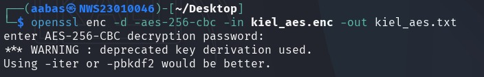 

5. Verify:

```bash
cat kiel_aes.txt
```

 

---

## 🔹 Task 2: Asymmetric Encryption using RSA (Kiel ↔ Aabas)

### 🎯 Objective
Encrypt and decrypt a message using RSA key pairs.

---

### 🛠️ Steps
### 👦🏽 Ezekiel 

1. Generate RSA Private Key:

```bash
openssl genpkey -algorithm RSA -out private.pem -pkeyopt rsa_keygen_bits:2048
```

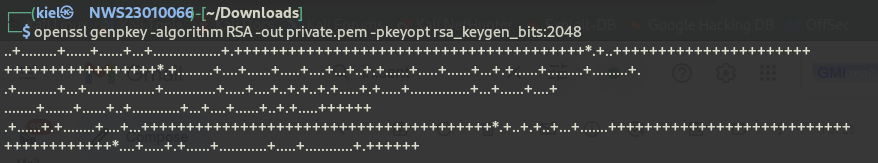 

2. Extract Public Key:

```bash
openssl rsa -in private.pem -pubout -out public.pem
```

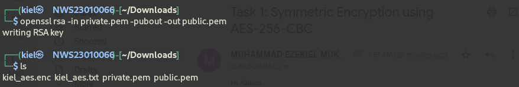 

3. Send public key,**public.pem** to Aabas. (Example: via Email/WhatsApp)

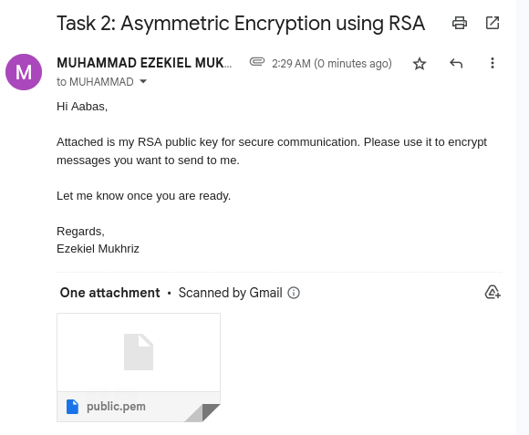

### 👦🏾 Aabas
4. Create message:
```bash
echo "flag{p1Nj4m_1oo}" > secret.txt
```

5. Encrypt with public key:

```bash
openssl rsautl -encrypt -inkey public.pem -pubin -in secret.txt -out aabas.enc
```

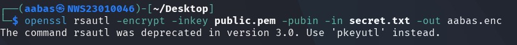 

6. Send encryption file,**aabas.enc** to Ezekiel. (Example: via Email/WhatsApp)

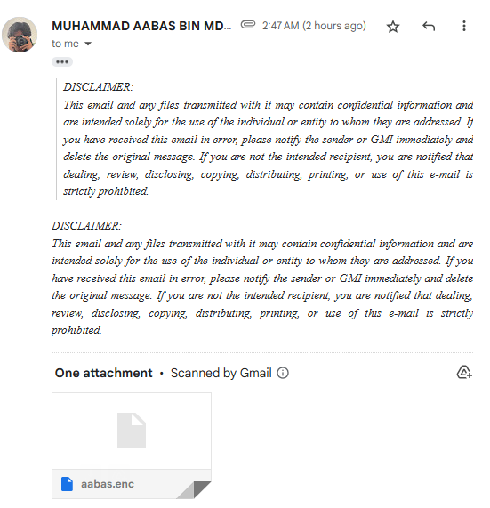 

### 👦🏽 Ezekiel 

7. Decrypt with private key:
```bash
openssl rsautl -decrypt -inkey private.pem -in aabas.enc -out aabas.txt
```

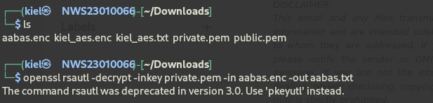

8. Verify:
```bash
cat aabas.txt
```

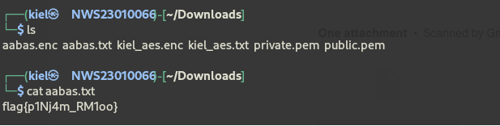

---

## 🔹 Task 3: Hashing and Message Integrity using SHA-256

### 🎯 Objective
Hash a file using SHA-256 and observe behavior after changes.

---

### 🛠️ Steps
### 👦🏽 Ezekiel 

1. Create a sample file:

```bash
echo "flag{SHA-256}" > ezekiel.txt
```

 

2. Generate SHA-256 hash:

```bash
openssl dgst -sha256 ezekiel.txt
```

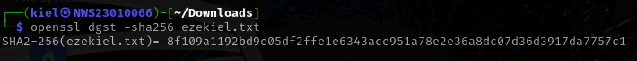 

3. Modify file:

```bash
echo "You have been hacked!" >> ezekiel.txt
```

 

4. Re-check hash:

```bash
openssl dgst -sha256 ezekiel.txt
```

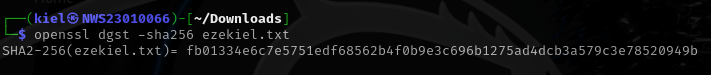 

5. Comparison between this two hashing:
    - 8f109a1192bd9e05df2ffe1e6343ace951a78e2e36a8dc07d36d3917da7757c1
    - fb01334e6c7e5751edf68562b4f0b9e3c696b1275ad4dcb3a579c3e78520949b

### 📌 Explanation
SHA-256 hash changes significantly even with tiny modifications. This is a core property of secure hash functions known as the **avalanche effect**– even a small change gives a totally different hash. This is how you know if a file is tampered with.

---

## 🔹 Task 4: Digital Signatures using RSA & SHA-256

### 🎯 Objective
Perform secure message exchange and signature verification between Kiel and Aabas.

- Digital signatures ensure that:
    - The message is from the right person (authenticity).
    - The message has not been changed (integrity).

---

### 🛠️ Steps
### 👦🏽 Ezekiel 

1. Generate private and public key:
- If already generate, skip to step 3.

```bash
openssl genpkey -algorithm RSA -out private.pem -pkeyopt rsa_keygen_bits:2048
openssl rsa -in private.pem -pubout -out public.pem
```


 

2. Send public key,**public.pem** to Aabas. (Example: via Email/WhatsApp)


3. Create message:

```bash
echo "flag{Ds_RSa+ShA-256}" > ds_kiel.txt
```

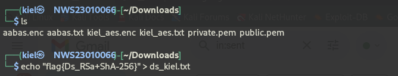

4. Sign it:

```bash
openssl dgst -sha256 -sign private.pem -out sign_kiel.bin ds_kiel.txt
```

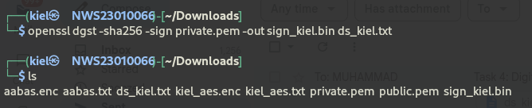

5. Send the files,**sign_kiel.bin** and **ds_kiel.txt** to Aabas. (Example: via Email/WhatsApp)

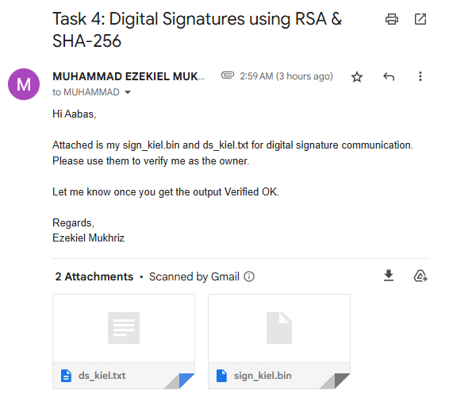

### 👦🏾 Aabas
6. Verify:

```bash
openssl dgst -sha256 -verify private.pem -signature sign_kiel.bin ds_kiel.txt
```
- Output: Verified OK


---

## 🚫 Tamper Check

### 👦🏾 Aabas
1. Modify message:

```bash
echo "_" >> ds_kiel.txt
```

2. Re-verify:

```bash
openssl dgst -sha256 -verify private.pem -signature sign_kiel.bin ds_kiel.txt
```

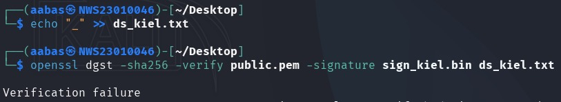
- Verification failure.

## ✅ Troubleshoot

### 👦🏾 Aabas / 👦🏽 Ezekiel
1. Modify message:

```bash
echo "hacked" >> ds_kiel.txt
cat ds_kiel.txt
```

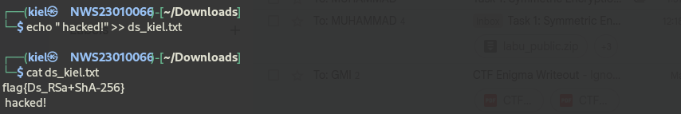

2. Verify:

```bash
openssl dgst -sha256 -verify private.pem -signature sign_kiel.bin ds_kiel.txt
```

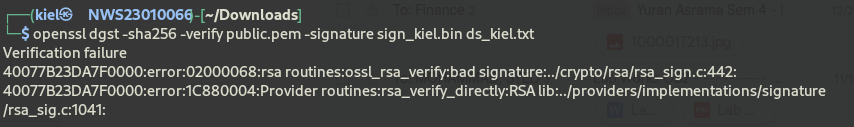
- Verification failure

3. Fix the file and re-verify:
```bash
echo "flag{Ds_RSa+ShA-256}" > ds_kiel.txt
openssl dgst -sha256 -verify private.pem -signature sign_kiel.bin ds_kiel.txt
```

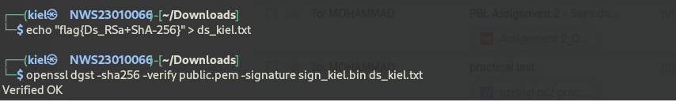

### 📌 Explanation:
- If someone modifies the message (adds “hacked”), verification fails.

- Once the original message is restored, the signature works again.

---

### 🎓 Summary:
- Task 1 (AES): Used a shared password to securely send a file.

- Task 2 (RSA): Used public/private keys to send secrets safely.

- Task 3 (SHA-256): Showed that even a small change in a file causes a big change in its hash.

- Task 4 (Digital Signature): Proved message integrity and sender identity using RSA + SHA-256.