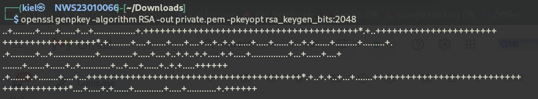
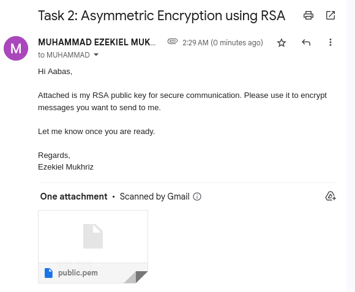

# Lab 3: Hands-on Exploration of Cryptographic Tools: Hashing, Encryption, and Digital Signatures ✍️🔒

### 📌 Objective
- Learn core cryptographic operations using OpenSSL.
- Practice symmetric (AES) and asymmetric (RSA) encryption.
- Understand hashing and digital signatures.
- Verify data integrity and non-repudiation through hands-on use.

---

## 🔹 Task 1: Symmetric Encryption using AES-256-CBC (Kiel ↔ Aabas)

### 🎯 Goal
Encrypt and decrypt a file using AES with CBC mode and verify content integrity.

---

### 🛠️ Steps

### ✅ Kiel 
1. Create a plaintext file:

```bash
echo "flag{AES_256_CBC}" > kiel_aes.txt
```
 

2. Encrypt using AES-256-CBC:

```bash
openssl enc -aes-256-cbc -salt -in kiel_aes.txt -out kiel_aes.enc -k abc123
```
 

3. Send encrypt file,**kiel_aes.enc** and password:**abc123** to Aabas. (Example: via Email/WhatsApp)


### ✅ Aabas 
4. Decrypt:

```bash
openssl enc -aes-256-cbc -d -in kiel_aes.enc -out kiel_aes.txt -k abc123
```
 

5. Verify:

```bash
cat kiel_aes.txt
```
 

---

## 🔹 Task 2: Asymmetric Encryption using RSA (Kiel ↔ Aabas)

### 🎯 Objective
Encrypt and decrypt a message using RSA key pairs.

---

### 🛠️ Steps
### ✅ Kiel → Aabas

1. Generate RSA Private Key:

```bash
openssl genpkey -algorithm RSA -out private.pem -pkeyopt rsa_keygen_bits:2048
```
 

2. Extract Public Key:

```bash
openssl rsa -in private.pem -pubout -out public.pem
```
 

3. Send public key,**public.pem** to Aabas. 
