# 🔒🐍 Lab 4: Implementing Cryptography with Python 

- **Author:** 👦🏾 Ezekiel Mukhriz
- **Partner:** 👦🏾 Muhammad Aabas 

### 📌 Objective
- Learn core cryptographic operations using Python.
- Practice symmetric (AES) and asymmetric (RSA) encryption.
- Understand hashing and digital signatures.
- Verify data integrity and authenticity through hands-on coding.

---

### 🐍 Python Installation
Make sure you have:
1. Install Python (3.8+ recommended).
2. Install libraries:
```bash
pip install cryptography pycryptodome
```

📷 Screenshot:


---

## 🔹 Task 1: Symmetric Encryption using AES-256-CBC (Kiel ↔ Aabas)

- Here is the [AES_encrypt.py](Python_Source/AES_encrypt.py) code. 
- Here is the [AES_decrypt.py](Python_Source/AES_decrypt.py) code.

### 🔐 What is it?
AES (Advanced Encryption Standard) is a widely used symmetric encryption algorithm. In symmetric encryption, the same key is used to both encrypt and decrypt the message.

We used the AES-256-CBC mode, which means:
- 256-bit key strength.
- CBC (Cipher Block Chaining) for better randomness and security.

---

### 🛠️ Steps:

### 👦🏾 Ezekiel 

1. Run `AES_encrypt.py`.

📷 Screenshot:

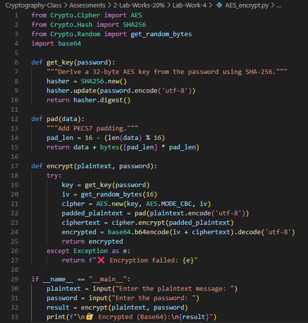 

2. Enter the **plaintext** and a strong **password**:
- **Plaintext message** (the message you want to encrypt)
✉️ Enter the plaintext message:
```bash
Cryptography Lab by Aabas & Ezekiel, DNWS23010046 & DNWS23010066
```

- **Password** (used to generate the AES encryption key)
🔑 Enter the password:
```bash
abc123
```

📷 Screenshot:

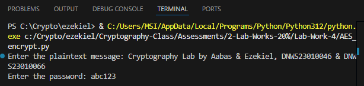 

3. The program **encrypts** the **message** and shows a **Base64-encoded ciphertext**:
Copy the **Base64 Encrypted Output**.
🔐 Encrypted Base64:
```output
4xkfvGC5HjXklUHWSQ2GrZ8z6/0/ocod4MfxQIwZF0bdkyUqV/NPDCSphF/wNsEXPe5pxaT9eS1W95rHuEsb1Y0nWLTbxA93jIMTUo9ID0GrgUvI6qNp7NqS5r0UO1mW
```

📷 Screenshot:

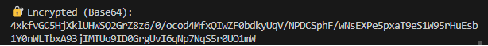 

4. Send the **Encrypted (Base64)** to Aabas (Example: via Email/WhatsApp):

### 👦🏾 Aabas 

1. Run `AES_decrypt.py`.

📷 Screenshot:

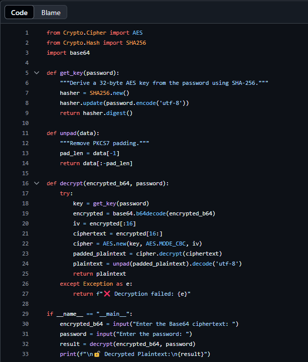 

2. Paste the **Base64-encoded ciphertext** received from Ezekiel:
Paste the **Base64 Encrypted Message** and enter the same **password** for encryption.

🔐 Enter the Base64 ciphertext:
```bash
4xkfvGC5HjXklUHWSQ2GrZ8z6/0/ocod4MfxQIwZF0bdkyUqV/NPDCSphF/wNsEXPe5pxaT9eS1W95rHuEsb1Y0nWLTbxA93jIMTUo9ID0GrgUvI6qNp7NqS5r0UO1mW
```

🔑 Enter the password:
```bash
abc123
```

📷 Screenshot:

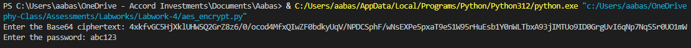

3. View the decrypted output to verify successful communication.

🔓 Decrypted plaintext:
```output
Cryptography Lab by Aabas & Ezekiel, DNWS23010046 & DNWS23010066
```

📷 Screenshot:

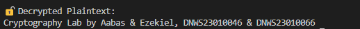 

### 🧠 Why It Matters
- ✔️ Used for secure file storage, database encryption, or private messaging.
- ✔️ Fast and efficient but requires secure key sharing since the same password must be known by both sender and receiver.

### ℹ️ Info
The difference in the encrypted Base64 outputs, despite using the same plaintext and password, is likely due to the use of a random initialization vector (IV) in the AES encryption process.
- Random IV: AES encryption uses a random initialization vector (IV) for each operation.
- Different Ciphertext: The unique IV results in different ciphertexts, even with the same plaintext and password.
- Enhanced Security: This randomness prevents identical plaintexts from producing identical ciphertexts, improving security.

---

## 🔹 Task 2: Asymmetric Encryption using RSA (Kiel ↔ Aabas)

- Here is the [RSA_key_pair.py](Python_Source/RSA_key_pair.py) code.
- Here is the [RSA_encrypt.py](Python_Source/RSA_encrypt.py) code.
- Here is the [RSA_decrypt.py](Python_Source/RSA_decrypt.py) code.

### 🔑 What is it?
**RSA** is an asymmetric encryption algorithm. It uses a **key pair**:
- A **public key** to encrypt.
- A **private key** to decrypt.
❗ Remember: Only the person with the private key can decrypt what’s been encrypted using the public key.

---

### 🛠️ Steps:

### 👦🏾 Aabas 

1. Run `RSA_key_pair.py` to generate **public** and **private keys**:
- A **public key** (shared)
🔐 Public Key (Base64):
```output
LS0tLS1CRUdJTiBQVUJMSUMgS0VZLS0tLS0KTUlJQklqQU5CZ2txaGtpRzl3MEJBUUVGQUFPQ0FROEFNSUlCQ2dLQ0FRRUFzUi9xYlI3bGI1TVdCanVBNUMySwptVks4VTl4RU9xQVZ0aFNaU3B0TUZ2eVpkK3grK2dXdEpMaGtWK2hBN2JjaVR2ZEFpSzJtcDk0cDhTV2FQL3BBCnp3Njh2NlUrVzB6eldGQmFLRWdSdmdkNjAyUWZNamE1YWsveE9mc2FncUIyWEZVaWVDaTlYZUhzNHFUNDVqWWkKQ3lEdE11cjlySmxFVlBKbXVRekhsTmg1YTZDQ2ZOSkxDb1VHVE1IY01HaGlMNmdBQmRUV2tzQXB2V3lvdjJLagpkeXROaHduSGNHNlFoUTBzYWlFcEltYzh3elJzV1Iwc3YvdS8yQ3dRQWMzT2c3cUlCemJpVEtBang0aXJReHNZCldxMVFXdHhMTWlrbnQxR1VjUmd2T01EcVRkQVZ3Z3dncEFvbTVBMVZzWHNaOUtNS2hKM0RqRlJsU2pwbW1uWmsKRlFJREFRQUIKLS0tLS1FTkQgUFVCTElDIEtFWS0tLS0t
```

- A **private key** (kept secret)
🔐 Private Key (Base64):
```output
LS0tLS1CRUdJTiBSU0EgUFJJVkFURSBLRVktLS0tLQpNSUlFb2dJQkFBS0NBUUVBc1IvcWJSN2xiNU1XQmp1QTVDMkttVks4VTl4RU9xQVZ0aFNaU3B0TUZ2eVpkK3grCitnV3RKTGhrVitoQTdiY2lUdmRBaUsybXA5NHA4U1dhUC9wQXp3Njh2NlUrVzB6eldGQmFLRWdSdmdkNjAyUWYKTWphNWFrL3hPZnNhZ3FCMlhGVWllQ2k5WGVIczRxVDQ1allpQ3lEdE11cjlySmxFVlBKbXVRekhsTmg1YTZDQwpmTkpMQ29VR1RNSGNNR2hpTDZnQUJkVFdrc0Fwdld5b3YyS2pkeXROaHduSGNHNlFoUTBzYWlFcEltYzh3elJzCldSMHN2L3UvMkN3UUFjM09nN3FJQnpiaVRLQWp4NGlyUXhzWVdxMVFXdHhMTWlrbnQxR1VjUmd2T01EcVRkQVYKd2d3Z3BBb201QTFWc1hzWjlLTUtoSjNEakZSbFNqcG1tblprRlFJREFRQUJBb0lCQURXRkFjWXdHRDZTOEl3NApqWlVreDZUVmNZOWJWb2hxVjdVWlcwcEdTNE1FbDNDN2xwQ0FoNVU1WENTTnlwU3BpZVhYWXZvSmtucFZzRkdyCnZZU0lYdTNSczZtcXlnRTNhcTRzTlZuSGtRamM1TG1jSHFzREN4cDdCbFl4TUF6NVpGbzQ1VDN1ZlcyeE51MHkKMFB4cXJmV3o0TWhLWmhVeGlJcXNaZXFUV0hqNlFQTDh3ZnoxWkd2S3lWTUliYytDeEQvNFRPcjJZaGxHTzJjOQozKzFvY0dhdGQzMGdmOGl4cENVL0pmTVRjcXp4UkZVU2tOcE9sT0hqdkVrL0tWSG5pMXl4dDMvWFVJOWdSVW1MCkhxVTRYNk5TMGhGSWQ2NEhEMlV5ZEpUT0tLRE9UdXpvWmxtSXdVcFpaTnFXY0ZFZkhBNHIxMUpBNEg2RUxrWUsKeW0wNHFaOENnWUVBeEI5UjFLKzlIeDRRUTA4eUlDNkQ0UnAvdEsvTFRLbnNBYytuVGhGNnVkQXhqRFJnM251VAprRW5hRGlEVjhpZEpoZ1YvU1pWNXkwOWRJTHNHcy9vNEZhVTJwbUNuTWtseU5MYWR1dTc2YnR3dlFEMlN1L243CjlJeFZMcnBTaU1EYXJHNC81Wnd2cVRqaTM1N1ArVExieVlSWVluYUVuc1VCVXp1dFM1ZnpKUk1DZ1lFQTV6UEMKOGJOcWw3ZjBSYXdNbmh6cXVCU1A1RHdPSStIaDNyTk5Ua2N0a0IwZmltSzFxN1dNdURNa1Z1WnNwSGQ1ZFRnaQpRbGQzZzc1c1YvWFNGM0RxS3l3b1hURnRHQ3NKbjlrSVhCVXV2RlZvcTBpbGNYcTdSUGRLUnNNQzcwaXJRMEUvCk5MU3I5U3ZKUHhabUpKR2JoOVI5SWZMaUI2UWJkd1RjYjc1M2Z6Y0NnWUErMjc3eGlTWDNiRDVRSkhqdllaazUKTTdJTXFtOWhjZkRIbjlPQ3JRMkZzcG0rMHliZENBU0NzWGpuSUZVU0dNOXkyaDR5Nm1xdjVBNzRKNWw5WTh4SAorN3pwVkg4aUdmSTF2UFlPN1B0dFByc1NQdW5odjd5bVk3Z0Zrd2hTOW1UZjhUSWZtSkNhRHpaLzc3bStxRE5UCmdreUZ1bkRGSm1WSFZSQTA4MDJsNndLQmdEaVpwMlBjZEgvbi9Oa0JvYVVqbHlLeGhmaHQ2MWhGZURJNDJ2Z0sKM05DbkVJMmtWSzFRcUw1L1pxb1BoeEZNWG1PZjltTWZYcGJXQzFnTlNmMkxHd2l1cXNNRjBwdFVEZXNnQ3JmZwpSNnk3akFCQ3JKMzNXZGtzWVBhcHp4SWRUREFPelJadUZKclV1VlBFZkFULzBIK1VPWDRTSTl1VEJWWkJ6bVZjCno0eEpBb0dBVnpDM0k0dElFUDdNQjl1STZDZlNNN1dpV0RxSnpldUVpVGxJV2hUTStpM1JHNk43dHdNWFFsNDEKMVA0TjNjUjFPMnFhNEhXSlZMTm5sNlhhU3ljZXcwdE9JVkZLYjBuc2JudFQ0T0c1L2c3MjA0YUdaZmROOCtHNApOS0crRlRHRzJHSjUzZXlkZThZakZ5bTYwcDl3QnJET3lKNWVaV0xDeDBycnBKaWtUN1U9Ci0tLS0tRU5EIFJTQSBQUklWQVRFIEtFWS0tLS0t
```

📷 Screenshot:

 

2. Share the **public key** with Ezekiel.

### 👦🏾 Ezekiel 

1. Run `RSA_encrypt.py`:

📷 Screenshot:

 

2. Enter the **plaintext** and Aabas's **public key**:
🔐 Enter **Base64-encoded RSA public key**:
```bash
LS0tLS1CRUdJTiBQVUJMSUMgS0VZLS0tLS0KTUlJQklqQU5CZ2txaGtpRzl3MEJBUUVGQUFPQ0FROEFNSUlCQ2dLQ0FRRUFzUi9xYlI3bGI1TVdCanVBNUMySwptVks4VTl4RU9xQVZ0aFNaU3B0TUZ2eVpkK3grK2dXdEpMaGtWK2hBN2JjaVR2ZEFpSzJtcDk0cDhTV2FQL3BBCnp3Njh2NlUrVzB6eldGQmFLRWdSdmdkNjAyUWZNamE1YWsveE9mc2FncUIyWEZVaWVDaTlYZUhzNHFUNDVqWWkKQ3lEdE11cjlySmxFVlBKbXVRekhsTmg1YTZDQ2ZOSkxDb1VHVE1IY01HaGlMNmdBQmRUV2tzQXB2V3lvdjJLagpkeXROaHduSGNHNlFoUTBzYWlFcEltYzh3elJzV1Iwc3YvdS8yQ3dRQWMzT2c3cUlCemJpVEtBang0aXJReHNZCldxMVFXdHhMTWlrbnQxR1VjUmd2T01EcVRkQVZ3Z3dncEFvbTVBMVZzWHNaOUtNS2hKM0RqRlJsU2pwbW1uWmsKRlFJREFRQUIKLS0tLS1FTkQgUFVCTElDIEtFWS0tLS0t
```
✉️ Enter **plaintext** to encrypt:
```bash
Cryptography Lab by Aabas & Ezekiel, DNWS23010046 & DNWS23010066
```


📷 Screenshot:

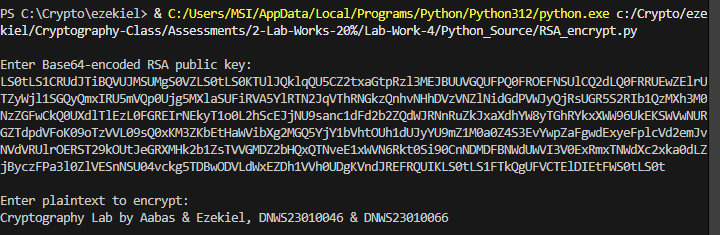 

3. Send the **Encrypted Data (Base64)** to Aabas (Example: via Email/WhatsApp):
🔐 **Encrypted Data (Base64)**:
```output
NRqQh4N8cp36MBbzDx0Sk1qWCRMydU0zqu7dWX2nY7EMfzMCgKbLwsUQroJUazHsRszNqFEeFID8khrDBTpt0y/qf8Dz3jo99hRdk qbf3nPwSXhz8LrwC70vKKuhAwEA101stMzxhnEdR+xPdTTGnhb5XwKpZZj+SXBMfdvEVM0b8wnZBgJDRHUtZUNr+vR050CTkUFPg+ fnIHap8w1k7Zz6uAQyf30qmJJsn1XXhakbkKvifdElolLp/SrRdfJ1DLYY5dn/fxOQEILNVTvykUK1AwBViRGDtuJZXDMOMIAE/kz IouSXBcmin5fJ6pWfJaGwnY9/jBnjEgnLM2ZY1Q== 
```

📷 Screenshot:

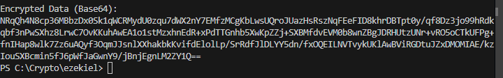 

### 👦🏾 Aabas 

1. Run `RSA_decrypt.py`:

📷 Screenshot:

 

2. Enter the **Base64 ciphertext** and use your **private key**:
🔐 Enter the **Base64 ciphertext**:
```bash
NRqQh4N8cp36MBbzDx0Sk1qWCRMydU0zqu7dWX2nY7EMfzMCgKbLwsUQroJUazHsRszNqFEeFID8khrDBTpt0y/qf8Dz3jo99hRdk qbf3nPwSXhz8LrwC70vKKuhAwEA101stMzxhnEdR+xPdTTGnhb5XwKpZZj+SXBMfdvEVM0b8wnZBgJDRHUtZUNr+vR050CTkUFPg+ fnIHap8w1k7Zz6uAQyf30qmJJsn1XXhakbkKvifdElolLp/SrRdfJ1DLYY5dn/fxOQEILNVTvykUK1AwBViRGDtuJZXDMOMIAE/kz IouSXBcmin5fJ6pWfJaGwnY9/jBnjEgnLM2ZY1Q== 
```

🔐 Enter the **Base64 private key**:
```bash
LS0tLS1CRUdJTiBSU0EgUFJJVkFURSBLRVktLS0tLQpNSUlFb2dJQkFBS0NBUUVBc1IvcWJSN2xiNU1XQmp1QTVDMkttVks4VTl4RU9xQVZ0aFNaU3B0TUZ2eVpkK3grCitnV3RKTGhrVitoQTdiY2lUdmRBaUsybXA5NHA4U1dhUC9wQXp3Njh2NlUrVzB6eldGQmFLRWdSdmdkNjAyUWYKTWphNWFrL3hPZnNhZ3FCMlhGVWllQ2k5WGVIczRxVDQ1allpQ3lEdE11cjlySmxFVlBKbXVRekhsTmg1YTZDQwpmTkpMQ29VR1RNSGNNR2hpTDZnQUJkVFdrc0Fwdld5b3YyS2pkeXROaHduSGNHNlFoUTBzYWlFcEltYzh3elJzCldSMHN2L3UvMkN3UUFjM09nN3FJQnpiaVRLQWp4NGlyUXhzWVdxMVFXdHhMTWlrbnQxR1VjUmd2T01EcVRkQVYKd2d3Z3BBb201QTFWc1hzWjlLTUtoSjNEakZSbFNqcG1tblprRlFJREFRQUJBb0lCQURXRkFjWXdHRDZTOEl3NApqWlVreDZUVmNZOWJWb2hxVjdVWlcwcEdTNE1FbDNDN2xwQ0FoNVU1WENTTnlwU3BpZVhYWXZvSmtucFZzRkdyCnZZU0lYdTNSczZtcXlnRTNhcTRzTlZuSGtRamM1TG1jSHFzREN4cDdCbFl4TUF6NVpGbzQ1VDN1ZlcyeE51MHkKMFB4cXJmV3o0TWhLWmhVeGlJcXNaZXFUV0hqNlFQTDh3ZnoxWkd2S3lWTUliYytDeEQvNFRPcjJZaGxHTzJjOQozKzFvY0dhdGQzMGdmOGl4cENVL0pmTVRjcXp4UkZVU2tOcE9sT0hqdkVrL0tWSG5pMXl4dDMvWFVJOWdSVW1MCkhxVTRYNk5TMGhGSWQ2NEhEMlV5ZEpUT0tLRE9UdXpvWmxtSXdVcFpaTnFXY0ZFZkhBNHIxMUpBNEg2RUxrWUsKeW0wNHFaOENnWUVBeEI5UjFLKzlIeDRRUTA4eUlDNkQ0UnAvdEsvTFRLbnNBYytuVGhGNnVkQXhqRFJnM251VAprRW5hRGlEVjhpZEpoZ1YvU1pWNXkwOWRJTHNHcy9vNEZhVTJwbUNuTWtseU5MYWR1dTc2YnR3dlFEMlN1L243CjlJeFZMcnBTaU1EYXJHNC81Wnd2cVRqaTM1N1ArVExieVlSWVluYUVuc1VCVXp1dFM1ZnpKUk1DZ1lFQTV6UEMKOGJOcWw3ZjBSYXdNbmh6cXVCU1A1RHdPSStIaDNyTk5Ua2N0a0IwZmltSzFxN1dNdURNa1Z1WnNwSGQ1ZFRnaQpRbGQzZzc1c1YvWFNGM0RxS3l3b1hURnRHQ3NKbjlrSVhCVXV2RlZvcTBpbGNYcTdSUGRLUnNNQzcwaXJRMEUvCk5MU3I5U3ZKUHhabUpKR2JoOVI5SWZMaUI2UWJkd1RjYjc1M2Z6Y0NnWUErMjc3eGlTWDNiRDVRSkhqdllaazUKTTdJTXFtOWhjZkRIbjlPQ3JRMkZzcG0rMHliZENBU0NzWGpuSUZVU0dNOXkyaDR5Nm1xdjVBNzRKNWw5WTh4SAorN3pwVkg4aUdmSTF2UFlPN1B0dFByc1NQdW5odjd5bVk3Z0Zrd2hTOW1UZjhUSWZtSkNhRHpaLzc3bStxRE5UCmdreUZ1bkRGSm1WSFZSQTA4MDJsNndLQmdEaVpwMlBjZEgvbi9Oa0JvYVVqbHlLeGhmaHQ2MWhGZURJNDJ2Z0sKM05DbkVJMmtWSzFRcUw1L1pxb1BoeEZNWG1PZjltTWZYcGJXQzFnTlNmMkxHd2l1cXNNRjBwdFVEZXNnQ3JmZwpSNnk3akFCQ3JKMzNXZGtzWVBhcHp4SWRUREFPelJadUZKclV1VlBFZkFULzBIK1VPWDRTSTl1VEJWWkJ6bVZjCno0eEpBb0dBVnpDM0k0dElFUDdNQjl1STZDZlNNN1dpV0RxSnpldUVpVGxJV2hUTStpM1JHNk43dHdNWFFsNDEKMVA0TjNjUjFPMnFhNEhXSlZMTm5sNlhhU3ljZXcwdE9JVkZLYjBuc2JudFQ0T0c1L2c3MjA0YUdaZmROOCtHNApOS0crRlRHRzJHSjUzZXlkZThZakZ5bTYwcDl3QnJET3lKNWVaV0xDeDBycnBKaWtUN1U9Ci0tLS0tRU5EIFJTQSBQUklWQVRFIEtFWS0tLS0t
```

📷 Screenshot:

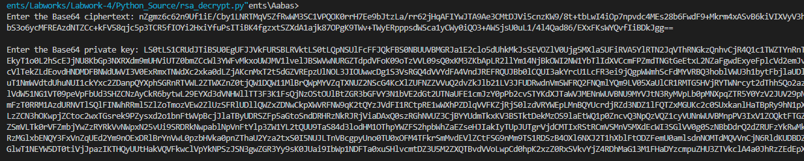 

3. View the decrypted message:
🔓 Decrypted message:
```output
Cryptography Lab by Aabas & Ezekiel, DNWS23010046 & DNWS23010066
```

📷 Screenshot:

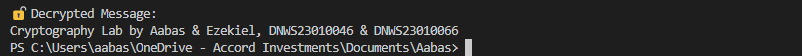 

### 🧠 Why It Matters
- ✔️ Enables secure communication without pre-shared keys.
- ✔️ Used in SSL/TLS, email encryption, and digital certificates.

### ℹ️ Info
Reusing old Base64 ciphertext in RSA encryption is not secure due to the deterministic nature of RSA without padding, which can lead to vulnerabilities.
- Predictable Output: RSA produces the same ciphertext for identical plaintexts and keys, making it insecure if reused.
- No Padding: Without proper padding (like OAEP), identical plaintexts yield identical ciphertexts, exposing patterns.
- Vulnerability to Attacks: Reusing ciphertext can allow attackers to exploit predictable patterns, risking plaintext recovery.

---

## 🔹 Task 3: Hashing and Message Integrity using SHA-256

- Here is the [Hashing_SHA-256.py](Python_Source/Hashing_SHA-256.py) code.

### 🧬 What is it?
Hashing transforms any input data into a fixed-size string (called a hash or digest).
We use SHA-256, a secure cryptographic hash function that always outputs 256-bit hashes.

---

### 🛠️ Steps

1. Run the script:
Run the Python script `Hashing_SHA-256.py` to start the hashing program.
 

2. Enter your message:
Type your **original plaintext message**.
Enter the text to Hash SHA-256:
```bash
Cryptography Lab by Ezekiel, DNWS23010066 !
```

📷 Screenshot:

 

🔑 SHA-256 Output:
```output
3343fe8541a33a630a151b45f5375008d1e020759847b630711d0fdd6c9f3e30
```

3. Modify the Message Slightly:
Now change a single character in the original input.
Example change: Replace `0066` ➜ `0046`
```bash
Cryptography Lab by Ezekiel, DNWS23010046 !
```

📷 Screenshot:

 

🔑 SHA-256 Output:
```output
d7ec10033d0d9e160e00fe31bc1fad1ce7c77d8c5101ad6b960f622849b12a0b
```

4. Compare the output:
- 1st hash: `Cryptography Lab by Ezekiel, DNWS23010066 !`
```output
3343fe8541a33a630a151b45f5375008d1e020759847b630711d0fdd6c9f3e30
```

- 2nd hash: `Cryptography Lab by Ezekiel, DNWS23010046 !`
```output
d7ec10033d0d9e160e00fe31bc1fad1ce7c77d8c5101ad6b960f622849b12a0b
```

### 🌪️ Avalanche Effect Explained

#### 🔍 What just happened?
Although only two digits were changed (66 ➜ 46), the entire SHA-256 hash changed drastically. This is known as the Avalanche Effect — a key property of cryptographic hash functions.

### 🧠 Why It Matters
- ✔️ Ensures file/data integrity with even tiny changes detected.
- ✔️ Critical for password security, blockchain integrity, and digital signatures.
---

## 🔹 Task 4: Task 4: Digital Signatures using RSA & SHA-256 (Kiel ↔ Aabas)

- Here is the [RSA_key_pair.py](Python_Source/RSA_key_pair.py) code.
- Here is the [Digital_Signature_signing.py](Python_Source/Digital_Signature_signing.py) code.
- Here is the [Digital_Signatures_verification.py](Python_Source/Digital_Signatures_verification.py) code.

---

### 🛠️ Steps

### 👦🏾 Aabas (Signing)

1. Run `Digital_Signatures_signing.py`:

📷 Screenshot:

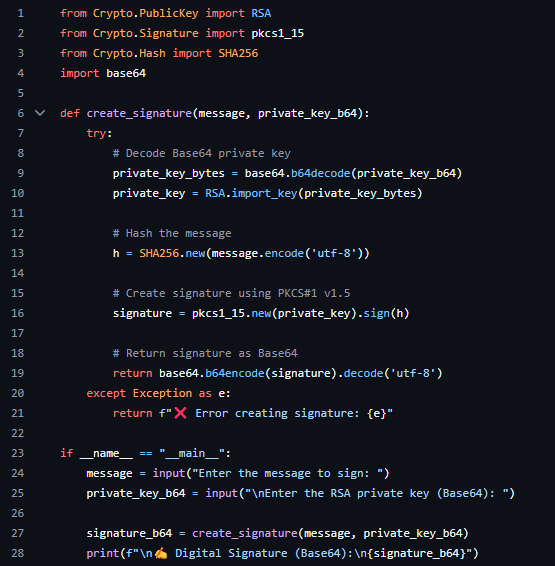 

2. Input the **plaintext** and your **private key**:
- Enter the message to sign:
```bash
Cryptography Lab by Aabas & Ezekiel > DNWS23010046 & DNWS23010066 !
```

- Enter the RSA private key (Base64):
```bash
LS0tLS1CRUdJTiBSU0EgUFJJVkFURSBLRVktLS0tLQpNSUlFb2dJQkFBS0NBUUVBc1IvcWJSN2xiNU1XQmp1QTVDMkttVks4VTl4RU9xQVZ0aFNaU3B0TUZ2eVpkK3grCitnV3RKTGhrVitoQTdiY2lUdmRBaUsybXA5NHA4U1dhUC9wQXp3Njh2NlUrVzB6eldGQmFLRWdSdmdkNjAyUWYKTWphNWFrL3hPZnNhZ3FCMlhGVWllQ2k5WGVIczRxVDQ1allpQ3lEdE11cjlySmxFVlBKbXVRekhsTmg1YTZDQwpmTkpMQ29VR1RNSGNNR2hpTDZnQUJkVFdrc0Fwdld5b3YyS2pkeXROaHduSGNHNlFoUTBzYWlFcEltYzh3elJzCldSMHN2L3UvMkN3UUFjM09nN3FJQnpiaVRLQWp4NGlyUXhzWVdxMVFXdHhMTWlrbnQxR1VjUmd2T01EcVRkQVYKd2d3Z3BBb201QTFWc1hzWjlLTUtoSjNEakZSbFNqcG1tblprRlFJREFRQUJBb0lCQURXRkFjWXdHRDZTOEl3NApqWlVreDZUVmNZOWJWb2hxVjdVWlcwcEdTNE1FbDNDN2xwQ0FoNVU1WENTTnlwU3BpZVhYWXZvSmtucFZzRkdyCnZZU0lYdTNSczZtcXlnRTNhcTRzTlZuSGtRamM1TG1jSHFzREN4cDdCbFl4TUF6NVpGbzQ1VDN1ZlcyeE51MHkKMFB4cXJmV3o0TWhLWmhVeGlJcXNaZXFUV0hqNlFQTDh3ZnoxWkd2S3lWTUliYytDeEQvNFRPcjJZaGxHTzJjOQozKzFvY0dhdGQzMGdmOGl4cENVL0pmTVRjcXp4UkZVU2tOcE9sT0hqdkVrL0tWSG5pMXl4dDMvWFVJOWdSVW1MCkhxVTRYNk5TMGhGSWQ2NEhEMlV5ZEpUT0tLRE9UdXpvWmxtSXdVcFpaTnFXY0ZFZkhBNHIxMUpBNEg2RUxrWUsKeW0wNHFaOENnWUVBeEI5UjFLKzlIeDRRUTA4eUlDNkQ0UnAvdEsvTFRLbnNBYytuVGhGNnVkQXhqRFJnM251VAprRW5hRGlEVjhpZEpoZ1YvU1pWNXkwOWRJTHNHcy9vNEZhVTJwbUNuTWtseU5MYWR1dTc2YnR3dlFEMlN1L243CjlJeFZMcnBTaU1EYXJHNC81Wnd2cVRqaTM1N1ArVExieVlSWVluYUVuc1VCVXp1dFM1ZnpKUk1DZ1lFQTV6UEMKOGJOcWw3ZjBSYXdNbmh6cXVCU1A1RHdPSStIaDNyTk5Ua2N0a0IwZmltSzFxN1dNdURNa1Z1WnNwSGQ1ZFRnaQpRbGQzZzc1c1YvWFNGM0RxS3l3b1hURnRHQ3NKbjlrSVhCVXV2RlZvcTBpbGNYcTdSUGRLUnNNQzcwaXJRMEUvCk5MU3I5U3ZKUHhabUpKR2JoOVI5SWZMaUI2UWJkd1RjYjc1M2Z6Y0NnWUErMjc3eGlTWDNiRDVRSkhqdllaazUKTTdJTXFtOWhjZkRIbjlPQ3JRMkZzcG0rMHliZENBU0NzWGpuSUZVU0dNOXkyaDR5Nm1xdjVBNzRKNWw5WTh4SAorN3pwVkg4aUdmSTF2UFlPN1B0dFByc1NQdW5odjd5bVk3Z0Zrd2hTOW1UZjhUSWZtSkNhRHpaLzc3bStxRE5UCmdreUZ1bkRGSm1WSFZSQTA4MDJsNndLQmdEaVpwMlBjZEgvbi9Oa0JvYVVqbHlLeGhmaHQ2MWhGZURJNDJ2Z0sKM05DbkVJMmtWSzFRcUw1L1pxb1BoeEZNWG1PZjltTWZYcGJXQzFnTlNmMkxHd2l1cXNNRjBwdFVEZXNnQ3JmZwpSNnk3akFCQ3JKMzNXZGtzWVBhcHp4SWRUREFPelJadUZKclV1VlBFZkFULzBIK1VPWDRTSTl1VEJWWkJ6bVZjCno0eEpBb0dBVnpDM0k0dElFUDdNQjl1STZDZlNNN1dpV0RxSnpldUVpVGxJV2hUTStpM1JHNk43dHdNWFFsNDEKMVA0TjNjUjFPMnFhNEhXSlZMTm5sNlhhU3ljZXcwdE9JVkZLYjBuc2JudFQ0T0c1L2c3MjA0YUdaZmROOCtHNApOS0crRlRHRzJHSjUzZXlkZThZakZ5bTYwcDl3QnJET3lKNWVaV0xDeDBycnBKaWtUN1U9Ci0tLS0tRU5EIFJTQSBQUklWQVRFIEtFWS0tLS0t
```

📷 Screenshot:

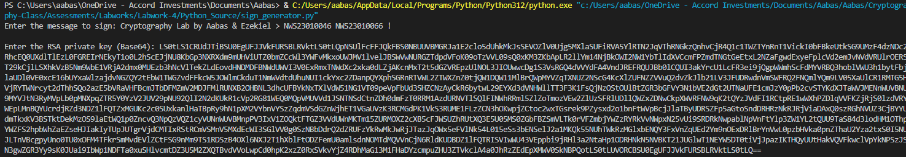  

3. Share the **digital signature (Base64)** and the **plaintext** with Kiel.
✍️ Digital Signature (Base64):
```output
Ti30u8brLNdJCF6mB4cVkotwb6CbC/qkDGCYrHpDp6aYcimXhe2amALBRBQ/7126FZ9VOt1HC2ISTa/a4071dHvQ9YSHsbSbGYFRh+QmoFTN2SBmwlJaqL1VhtN4mgbffxe8dp6D350tVwSyEv23EUe5hYEyXCRPPtss/bJMjrxU07GhTh4E8GjH73UNq620yz1o9QHGPKy3rFFWrKhSIOxK+8wevfzEDbpCA3b1Ne09BrrzyuGTkKhvAYbGg8mvN70i49Gj1UA/wf+dszM7ImBV0DrlwzHOcA+SbYAWAT0F3vV9yqp4OMHZVX4P3LeNRbORXRsEck1ngDjBacyPhA==
```

📷 Screenshot:

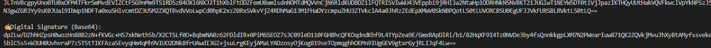 

### 👦🏾 Ezekiel (Verification)

1. Run `Digital_Signatures_verification.py`:

📷 Screenshot:

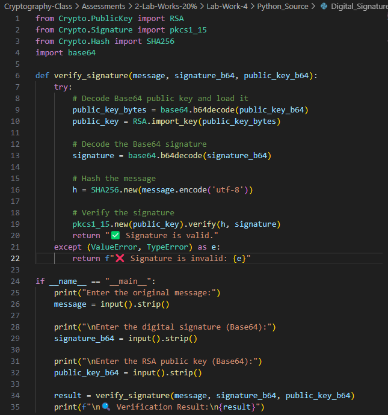 

2. Enter Aabas’s **original message, digital signature (Base64)** and **public key** to verify the signature:
- ✉️ Enter the original message:
```bash
Cryptography Lab by Aabas & Ezekiel > DNWS23010046 & DNWS23010066 !
```

- ✍️ Enter the digital signature (Base64):
```bash
Ti30u8brLNdJCF6mB4cVkotwb6CbC/qkDGCYrHpDp6aYcimXhe2amALBRBQ/7126FZ9VOt1HC2ISTa/a4071dHvQ9YSHsbSbGYFRh+QmoFTN2SBmwlJaqL1VhtN4mgbffxe8dp6D350tVwSyEv23EUe5hYEyXCRPPtss/bJMjrxU07GhTh4E8GjH73UNq620yz1o9QHGPKy3rFFWrKhSIOxK+8wevfzEDbpCA3b1Ne09BrrzyuGTkKhvAYbGg8mvN70i49Gj1UA/wf+dszM7ImBV0DrlwzHOcA+SbYAWAT0F3vV9yqp4OMHZVX4P3LeNRbORXRsEck1ngDjBacyPhA==
```

- 🔐 Enter the RSA public key (Base64):
```bash
LS0tLS1CRUdJTiBQVUJMSUMgS0VZLS0tLS0KTUlJQklqQU5CZ2txaGtpRzl3MEJBUUVGQUFPQ0FROEFNSUlCQ2dLQ0FRRUFzUi9xYlI3bGI1TVdCanVBNUMySwptVks4VTl4RU9xQVZ0aFNaU3B0TUZ2eVpkK3grK2dXdEpMaGtWK2hBN2JjaVR2ZEFpSzJtcDk0cDhTV2FQL3BBCnp3Njh2NlUrVzB6eldGQmFLRWdSdmdkNjAyUWZNamE1YWsveE9mc2FncUIyWEZVaWVDaTlYZUhzNHFUNDVqWWkKQ3lEdE11cjlySmxFVlBKbXVRekhsTmg1YTZDQ2ZOSkxDb1VHVE1IY01HaGlMNmdBQmRUV2tzQXB2V3lvdjJLagpkeXROaHduSGNHNlFoUTBzYWlFcEltYzh3elJzV1Iwc3YvdS8yQ3dRQWMzT2c3cUlCemJpVEtBang0aXJReHNZCldxMVFXdHhMTWlrbnQxR1VjUmd2T01EcVRkQVZ3Z3dncEFvbTVBMVZzWHNaOUtNS2hKM0RqRlJsU2pwbW1uWmsKRlFJREFRQUIKLS0tLS1FTkQgUFVCTElDIEtFWS0tLS0t
```

📷 Screenshot:

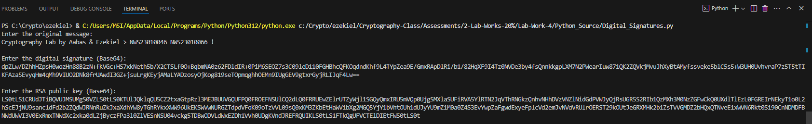 

3. Confirm if the message is authentic and untampered:
- The message is **valid**. ✅
```output
🔍 Verification Result:
✅ Signature is valid.
```

📷 Screenshot:

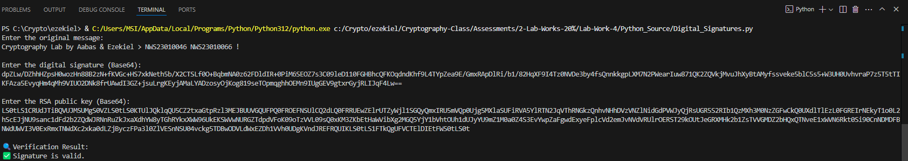

- The message is **invalid**. ❌
Now change a single character in the original input.
Example change: Add `- Hacked` 
```output
🔍 Verification Result:
❌ Signature is invalid: Invalid signature
```

📷 Screenshot:

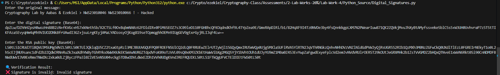

### 🧠 Why It Matters
- ✔️ Ensures authenticity (from the claimed sender).
- ✔️ Ensures integrity (message has not changed).
- ✔️ Used in software signing, banking transactions, blockchains, and contracts.
---

### 🧠 Conclusion
This lab provided hands-on experience with:
- 🔐 AES symmetric encryption
- 🔑 RSA asymmetric encryption
- 🧬 Hashing with SHA-256
- ✍️ Digital signature generation and verification

Each task reinforces the importance of confidentiality, integrity, and authenticity in secure communication.
