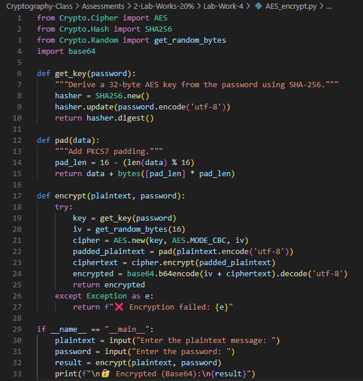
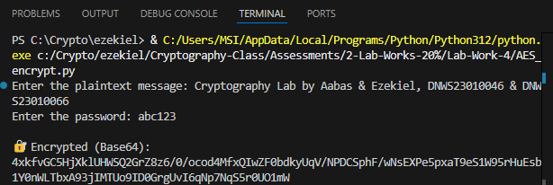

# 🔒🐍 Lab 4: Implementing Cryptography with Python 

- **Author:** 👦🏽 Ezekiel Mukhriz
- **Partner:** 👦🏾 Muhammad Aabas 

### 📌 Objective
- Learn core cryptographic operations using Python.
- Practice symmetric (AES) and asymmetric (RSA) encryption.
- Understand hashing and digital signatures.
- Verify data integrity and authenticity through hands-on coding.

---

### 🐍 Python Installation
Before you begin:
1. Install Python (3.8+ recommended).
2. Install necessary libraries:
```bash
pip install cryptography pycryptodome
```


---

## 🔹 Task 1: Symmetric Encryption using AES-256-CBC (Kiel ↔ Aabas)

- Here is my [AES_python](AES_encrypt.py) code.

---

### 🛠️ Steps

### 👦🏽 Ezekiel 

1. Make encryption code python:
 

2. Fill the **plaintext** & **password**:


3. Send the **Encrypted (Base64)** to Aabas (Example: via Email/WhatsApp):


### 👦🏾 Aabas 

1. Make decryption code python:
 

2. Fill the **decryption** & **password**:


3. Send the **Encrypted (Base64)** to Aabas (Example: via Email/WhatsApp):


---

## 🔹 Task 2: Asymmetric Encryption using RSA (Kiel ↔ Aabas)

- Here is my [RSA_python](RSA_encrypt.py) code.

---

### 🛠️ Steps

### 👦🏽 Ezekiel 

1. Make encryption code python:
 

2. Fill the **plaintext** & **password**:


3. Send the **Encrypted (Base64)** to Aabas (Example: via Email/WhatsApp):


### 👦🏾 Aabas 