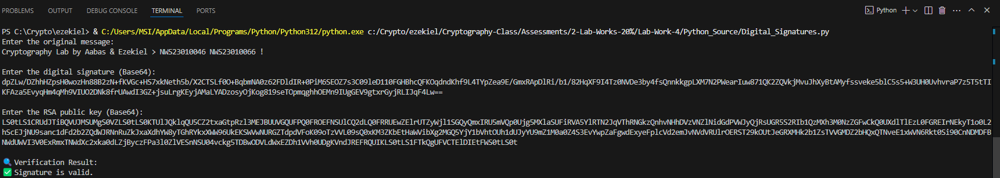
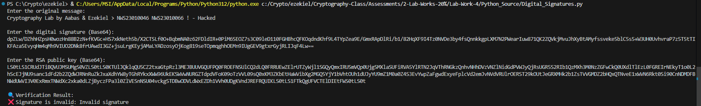

# 🔒🐍 Lab 4: Implementing Cryptography with Python 

- **Author:** 👦🏽 Ezekiel Mukhriz
- **Partner:** 👦🏾 Muhammad Aabas 

### 📌 Objective
- Learn core cryptographic operations using Python.
- Practice symmetric (AES) and asymmetric (RSA) encryption.
- Understand hashing and digital signatures.
- Verify data integrity and authenticity through hands-on coding.

---

### 🐍 Python Installation
Make sure you have:
1. Install Python (3.8+ recommended).
2. Install necessary libraries:
```bash
pip install cryptography pycryptodome
```


---

## 🔹 Task 1: Symmetric Encryption using AES-256-CBC (Kiel ↔ Aabas)

- Here is the [AES_encrypt.py](Python_Source/AES_encrypt.py) python code.
- Here is the [AES_decrypt.py](Python_Source/AES_decrypt.py) python code.

---

### 🛠️ Steps:

### 👦🏽 Ezekiel 

1. Run `AES_encrypt.py`:

 

2. Enter the **plaintext** and a strong **password**:

 

3. Copy the **Base64 Encrypted Output**:

 

4. Send the **Encrypted (Base64)** to Aabas (Example: via Email/WhatsApp):

### 👦🏾 Aabas 

1. Run `AES_decrypt.py`:

 

2. Paste the **Base64 Encrypted Message** and enter the same **password**:


3. View the decrypted output to verify successful communication:

 

---

## 🔹 Task 2: Asymmetric Encryption using RSA (Kiel ↔ Aabas)

- Here is the [RSA_key_pair.py](Python_Source/RSA_key_pair.py) code.
- Here is the [RSA_encrypt.py](Python_Source/RSA_encrypt.py) code.
- Here is the [RSA_decrypt.py](Python_Source/RSA_decrypt.py) code.

---

### 🛠️ Steps:

### 👦🏾 Aabas 

1. Run `RSA_key_pair.py` to generate **public** and **private keys**:

 

2. Share the **public key** with Ezekiel.

### 👦🏽 Ezekiel 

1. Run `RSA_encrypt.py`:

 

2. Enter the **plaintext** and Aabas's **public key**:

 

3. Send the **Encrypted (Base64)** to Aabas (Example: via Email/WhatsApp):

 

### 👦🏾 Aabas 

1. Run `RSA_decrypt.py`:

 

2. Enter the **encrypted message** and use your **private key**:

 

3. View the decrypted message:

 

---

## 🔹 Task 3: Hashing and Message Integrity using SHA-256

- Here is the [Hashing_SHA-256.py](Python_Source/Hashing_SHA-256.py) code.

---

### 🛠️ Steps

1. Run `Hashing_SHA-256.py`:

 

2. Enter your **plaintext message**:


3. Edit :


4. 


---

## 🔹 Task 4: Task 4: Digital Signatures using RSA & SHA-256 (Kiel ↔ Aabas)

- Here is the [Digital_Signatures.py](Python_Source/Digital_Signatures.py) code.

---

### 🛠️ Steps

### 👦🏽 Ezekiel 

1. Make encryption code python:

 

2. Fill the **plaintext** & **password**:

  

3. Send the **Encrypted (Base64)** to Aabas (Example: via Email/WhatsApp):


### 👦🏾 Aabas 


---

