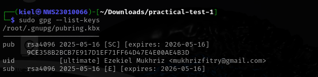

# 🧪 Practical Test 1

---

## ✅ Task 1: Generate Your GPG Key Pair

**Objective:** Use `gpg` to generate an RSA key pair tied to your identity.

### 🔧 Steps:
1. Generate key:
```bash
sudo gpg --full-generate-key
```

Insert all of this:
- Key type: RSA and RSA
- Key size: 4096 bits
- Expiration: 1y
- Name: Ezekiel Mukhriz
- Email: mukhrizfitry@gmail.com

📷 Screenshot:

  

### 🔍 Output

📷 Screenshot:

 

```bash
gpg --list-keys
```

📷 Screenshot:



---

## ✅ Task 2: Encrypt and Decrypt a File

**Objective:** Perform GPG encryption and decryption.

### 🔧 Steps:

1. Create the message:
```bash
echo "This file was encrypted by Ezekiel MUkhriz NWS23010066" > message.txt
```

📷 Screenshot:

 

2. Encrypt with your own public key:
```bash
gpg -e -r "Ezekiel Mukhriz" message.txt
```

📷 Screenshot:

 

3. Decrypt the file:
```bash
gpg -d message.txt.gpg > decrypted.txt
```

📷 Screenshot:

 

 

4. Verify the output:
```bash
cat decrypted.txt
```

📷 Screenshot:

 

---

## ✅ Task 3: Sign and Verify a Message

**Objective:** Digitally sign a message and verify authenticity.

### 🔧 Steps:

1. Create the message:
```bash
echo "I, Ezekiel Mukhriz, declare this is my work." > signed_message.txt
```

📷 Screenshot:

  

2. Sign the file:
```bash
gpg --clearsign signed_message.txt
```

📷 Screenshot:

 

3. Verify the signature:
```bash
gpg --verify signed_message.txt.asc
```

📷 Screenshot:

 

---

## ✅ Task 4: Configure Passwordless SSH Authentication

**Objective:** Set up SSH key-based login to localhost or a test VM.

### 🔧 Steps:

1. Run the following command in Windows Powershell:
```bash
ssh-keygen -t rsa
```

📷 Screenshot:

 

- just press enter to save it in the default path
- leave the passphrase empty for passwordless authentication

2. Go to `.ssh` and check the ssh-key file that has been generate:
```bash
ls
cd .ssh
```
📷 Screenshot:

  

3. See the content of the `id_rsa.pub`:
```bash
cat id_rsa.pub
```

📷 Screenshot:


- copy it to `authorized_keys` in **Kali Linux**

4. Run the following command in **Kali Linux terminal**:
```bash
cd .ssh
vim authorized_keys
```

📷 Screenshot:

 
 

5. Make sure set the permission as below in Kali Linux:
```bash
chmod 700 ~/.ssh
chmod 600 ~/.ssh/authorized_keys
```

📷 Screenshot:

 