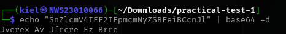
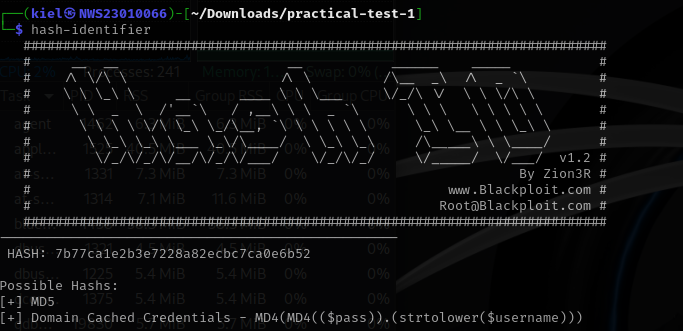
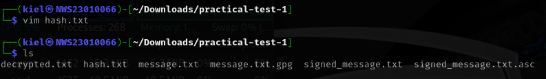
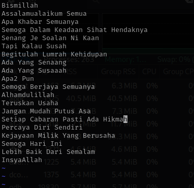
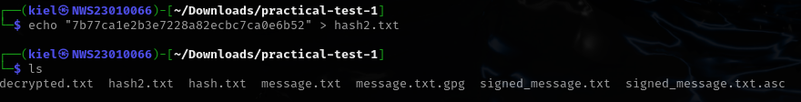
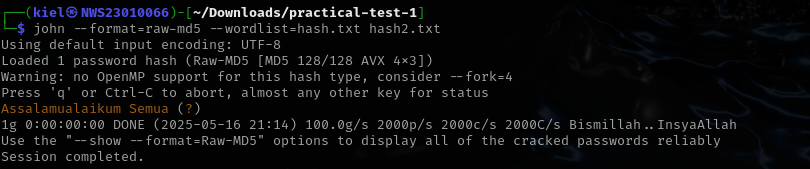
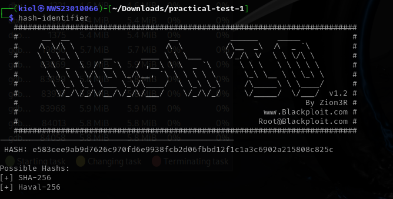
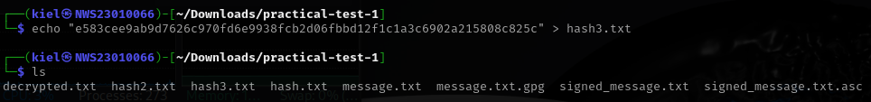
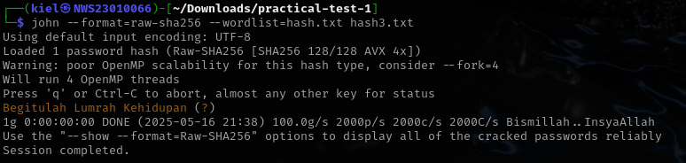

# 🧪 Practical Test 1

---

## ✅ Task 1: Generate Your GPG Key Pair

**Objective:** Use `gpg` to generate an RSA key pair tied to your identity.

### 🔧 Steps:
1. Generate key:
```bash
sudo gpg --full-generate-key
```

Insert all of this:
- Key type: 1 `RSA and RSA`
- Key size: 4096 `4096 bits`
- Expiration: 1y `1 year`
- Name: Ezekiel Mukhriz
- Email: mukhrizfitry@gmail.com

📷 Screenshot:

  

### 🔍 Output

📷 Screenshot:

 

```bash
sudo gpg --list-keys
```

📷 Screenshot:


---

## ✅ Task 2: Encrypt and Decrypt a File

**Objective:** Perform GPG encryption and decryption.

### 🔧 Steps:

1. Create the message:
```bash
echo "This file was encrypted by Ezekiel MUkhriz NWS23010066" > message.txt
```

📷 Screenshot:

 

2. Encrypt with your own public key:
```bash
gpg -e -r "Ezekiel Mukhriz" message.txt
```

📷 Screenshot:

 

3. Decrypt the file:
```bash
gpg -d message.txt.gpg > decrypted.txt
```

📷 Screenshot:

 

- For my passphrase: kiel1234

 

4. Verify the output:
```bash
cat decrypted.txt
```

📷 Screenshot:

 

---

## ✅ Task 3: Sign and Verify a Message

**Objective:** Digitally sign a message and verify authenticity.

### 🔧 Steps:

1. Create the message:
```bash
echo "I, Ezekiel Mukhriz, declare this is my work." > signed_message.txt
```

📷 Screenshot:

  

2. Sign the file:
```bash
gpg --clearsign signed_message.txt
```

📷 Screenshot:

 

3. Verify the signature:
```bash
gpg --verify signed_message.txt.asc
```

📷 Screenshot:

 

---

## ✅ Task 4: Configure Passwordless SSH Authentication

**Objective:** Set up SSH key-based login to localhost or a test VM.

### 🔧 Steps:

1. Run the following command in **Windows Powershell**:
```bash
ssh-keygen -t rsa
```

📷 Screenshot:

 

- just press enter to save it in the default path
- leave the passphrase empty for passwordless authentication

2. Go to `.ssh` and check the ssh-key file that has been generate:
```bash
ls
cd .ssh
```
📷 Screenshot:

  

3. See the content of the `id_rsa.pub`:
```bash
cat id_rsa.pub
```

📷 Screenshot:


- copy it to `authorized_keys` in **Kali Linux**

4. Run the following command in **Kali Linux terminal**:
```bash
cd .ssh
vim authorized_keys
```

📷 Screenshot:

 
 

5. Make sure set the permission as below in **Kali Linux**:
```bash
chmod 700 ~/.ssh
chmod 600 ~/.ssh/authorized_keys
```

📷 Screenshot:

  

6. SSH in **Windowds Powershell** to **Kali Linux**:
- format command `ssh username@ip address`.
```bash
ssh kiel@10.100.122.232
```

📷 Screenshot:


### 🔍 Output

📷 Screenshot:


---

## ✅ Task 5: Hash Cracking Challenge

**Objective:**  Crack the given hash values.

### 🔧 Steps:

### 🔐 Hash 1:

1. Decode the Base64 String
```bash
echo "SnZlcmV4IEF2IEpmcmNyZSBFeiBCcnJl" | base64 -d
```

📷 Screenshot:

 

### 🔐 Hash 2:

1. Identify the hash using tool `hash-identifier`:
```bash
hash-identifier
```

📷 Screenshot:

 

- Insert '`7b77ca1e2b3e7228a82ecbc7ca0e6b52` in `Hash:` command.
- The output is `MD5`.

2. Make the wordlist:
```bash
vim hash.txt
```

📷 Screenshot:



- Insert all of this into `hash.txt`:
```
Bismillah
Assalamualaikum Semua
Apa Khabar Semuanya
Semoga Dalam Keadaan Sihat Hendaknya
Senang Je Soalan Ni Kaan
Tapi Kalau Susah
Begitulah Lumrah Kehidupan
Ada Yang Senaang
Ada Yang Susaaah
Apa2 Pun
Semoga Berjaya Semuanya
Alhamdulillah
Teruskan Usaha
Jangan Mudah Putus Asa
Setiap Cabaran Pasti Ada Hikmah
Percaya Diri Sendiri
Kejayaan Milik Yang Berusaha
Semoga Hari Ini
Lebih Baik Dari Semalam
InsyaAllah
```

📷 Screenshot:

 

3. Insert the hash into file:
```bash
echo "7b77ca1e2b3e7228a82ecbc7ca0e6b52" > hash2.txt
```

📷 Screenshot:

 

4. Crack the hash using tool `john the ripper`:
```bash
john --format=raw-md5 --wordlist=hash.txt hash2.txt
```

📷 Screenshot:

 

- So the output of thash is `Assalamualaikum Semua`.

### 🔐 Hash 3:

1. Identify the hash using tool `hash-identifier`:
```bash
hash-identifier
```

📷 Screenshot:

 

- Insert `e583cee9ab9d7626c970fd6e9938fcb2d06fbbd12f1c1a3c6902a215808c825c` in `Hash:` command.
- The output is `SHA-256`.

2. Insert the hash into file:
```bash
echo "e583cee9ab9d7626c970fd6e9938fcb2d06fbbd12f1c1a3c6902a215808c825c" > hash3.txt
```

📷 Screenshot:

 

4. Crack the hash using tool `john the ripper`:
```bash
john --format=raw-sha-256 --wordlist=hash.txt hash3.txt
```

📷 Screenshot:

 

- So the output of thash is `Begitulah Lumrah Kehidupan`.